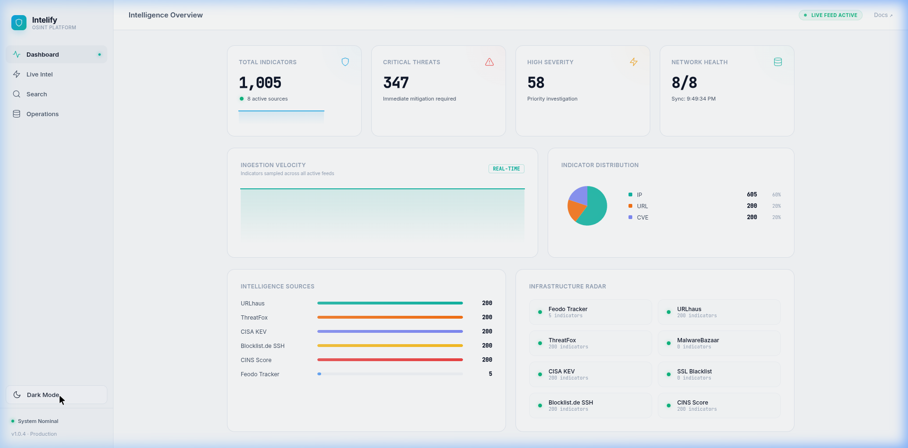
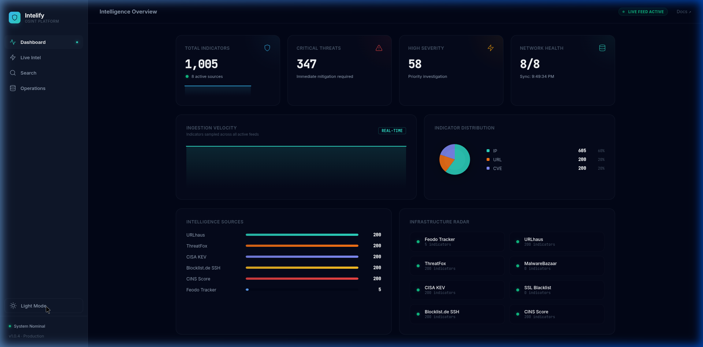
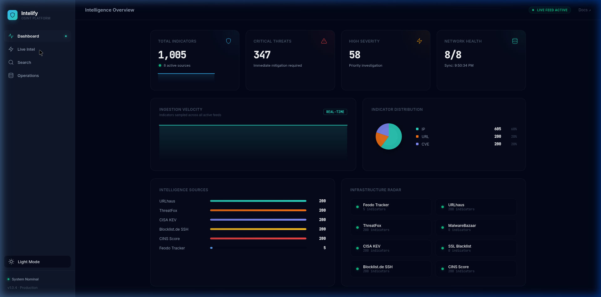
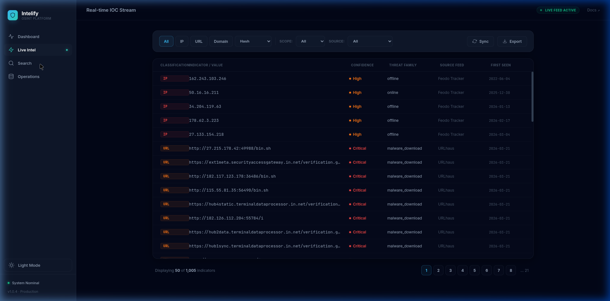
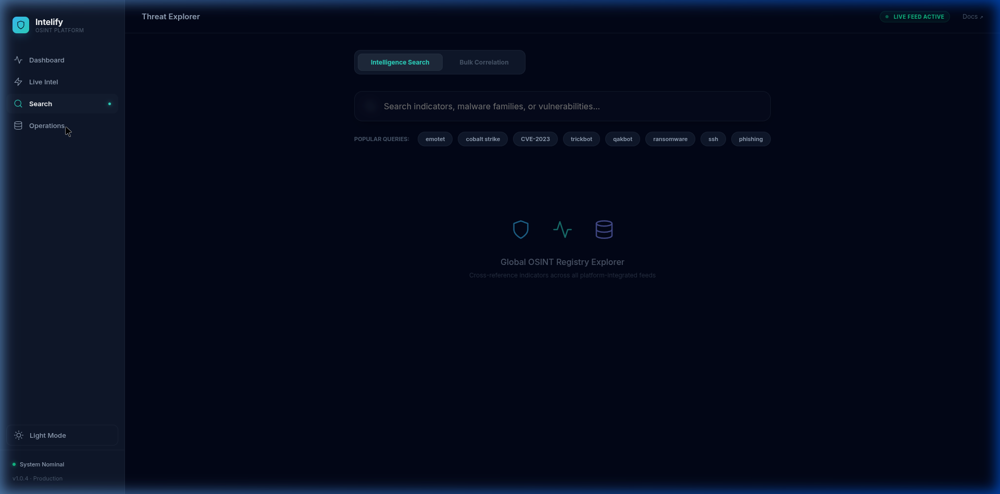

# Intelify 🛡️

**Open-source, real-time Cyber Threat Intelligence platform.**  
Ingests live IOC feeds, provides a searchable REST API, and a React dashboard — no API keys, no subscriptions required.


--- 

## Features

- **Real-time feed ingestion** — 8 open-source feeds auto-refreshed in the background
- **REST API** — FastAPI backend with full OpenAPI/Swagger docs at `/docs`
- **React dashboard** — Live feed table, IOC search, bulk lookup, feed health management
- **Zero dependencies on paid services** — all data from free, public threat intel sources
- **CSV export** — download any filtered IOC set
- **Docker Compose** — one command to run everything

---

## 📸 Interface Tour

### Slate Dark Mode (Default)


### Light Mode


### Real-time Feed Monitoring


### Threat Search & Correlation


### Infrastructure Radar


---

## Data Sources

| Feed | Organization | IOC Types | Refresh |
|------|-------------|-----------|---------|
| [Feodo Tracker](https://feodotracker.abuse.ch) | Abuse.ch | Botnet C2 IPs | 5 min |
| [URLhaus](https://urlhaus.abuse.ch) | Abuse.ch | Malware URLs | 5 min |
| [ThreatFox](https://threatfox.abuse.ch) | Abuse.ch | IPs, Domains, URLs, Hashes | 5 min |
| [MalwareBazaar](https://bazaar.abuse.ch) | Abuse.ch | Malware SHA256 hashes | 10 min |
| [CISA KEV](https://www.cisa.gov/known-exploited-vulnerabilities-catalog) | CISA (US Gov) | Known Exploited CVEs | 60 min |
| [SSL Blacklist](https://sslbl.abuse.ch) | Abuse.ch | Malicious SSL cert hashes | 30 min |
| [Blocklist.de SSH](https://www.blocklist.de) | Blocklist.de | SSH brute-force IPs | 10 min |
| [CINS Score](https://cinsscore.com) | Sentinel IPS | Bad actor IPs | 15 min |

All feeds are **free** and **require no API key**.

---

## Architecture

```
┌─────────────────────────────────────────────────────────────┐
│                        React Frontend                        │
│   Dashboard · Live Feed · IOC Search · Feed Management      │
└──────────────────────┬──────────────────────────────────────┘
                       │ HTTP /api/v1/*
┌──────────────────────▼──────────────────────────────────────┐
│                   FastAPI Backend                            │
│   /iocs  /feeds  /stats  /search                            │
│                                                              │
│   FeedManager (asyncio background tasks)                    │
│   ┌──────────┐ ┌──────────┐ ┌──────────┐ ┌──────────┐      │
│   │  Feodo   │ │ URLhaus  │ │ThreatFox │ │ Bazaar   │ ...  │
│   └──────────┘ └──────────┘ └──────────┘ └──────────┘      │
└─────────────────────────────────────────────────────────────┘
         │ aiohttp async fetches to public feed URLs
         ▼
   Open-Source Threat Intelligence Feeds (internet)
```

---

## Quick Start

### Option 1 — Docker Compose (recommended)

```bash
git clone https://github.com/subrat243/Intelify.git
cd Intelify
docker compose up --build
```

- Frontend: http://localhost:5173  
- Backend API: http://localhost:8000  
- Swagger docs: http://localhost:8000/docs

---

### Option 2 — Local development

**Backend:**

```bash
cd backend
python -m venv .venv
source .venv/bin/activate        # Windows: .venv\Scripts\activate
pip install -r requirements.txt
uvicorn main:app --reload --port 8000
```

**Frontend** (new terminal):

```bash
cd frontend
npm install
npm run dev
```

Frontend will be at http://localhost:5173 and proxies `/api` → `localhost:8000`.

---

## REST API Reference

Base URL: `http://localhost:8000/api/v1`

| Method | Endpoint | Description |
|--------|----------|-------------|
| `GET` | `/stats/` | Platform stats — total IOCs, by type, by source |
| `GET` | `/feeds/` | List all configured feeds and their status |
| `GET` | `/feeds/{id}` | Single feed info |
| `POST` | `/feeds/{id}/refresh` | Trigger immediate feed re-fetch |
| `POST` | `/feeds/refresh-all` | Re-fetch all feeds |
| `GET` | `/iocs/` | List/filter IOCs (`q`, `type`, `confidence`, `source`, `page`, `limit`) |
| `GET` | `/iocs/{id}` | Single IOC detail |
| `POST` | `/iocs/lookup` | Bulk lookup `{ "values": ["1.2.3.4", "evil.ru"] }` |
| `GET` | `/search/?q=` | Full-text search across all IOCs |

Interactive docs: http://localhost:8000/docs

**Example requests:**

```bash
# Get platform stats
curl http://localhost:8000/api/v1/stats/

# Search for Emotet IOCs
curl "http://localhost:8000/api/v1/iocs/?q=emotet&confidence=Critical"

# Bulk lookup
curl -X POST http://localhost:8000/api/v1/iocs/lookup \
  -H "Content-Type: application/json" \
  -d '{"values": ["185.220.101.1", "CVE-2023-44487"]}'

# Trigger feed refresh
curl -X POST http://localhost:8000/api/v1/feeds/feodo/refresh
```

---

## Project Structure

```
Intelify/
├── backend/
│   ├── main.py                  # FastAPI app + lifespan
│   ├── requirements.txt
│   ├── Dockerfile
│   ├── models/
│   │   └── schemas.py           # Pydantic models (IOC, Feed, Stats)
│   ├── services/
│   │   └── feed_manager.py      # Feed fetching, parsing, scheduling
│   └── routers/
│       ├── iocs.py
│       ├── feeds.py
│       ├── stats.py
│       └── search.py
├── frontend/
│   ├── index.html
│   ├── vite.config.js
│   ├── package.json
│   ├── Dockerfile
│   ├── nginx.conf
│   └── src/
│       ├── App.jsx              # Layout + sidebar navigation
│       ├── main.jsx
│       ├── components/
│       │   └── ui.jsx           # Shared: Badge, Spinner, IOCModal, SparkLine...
│       ├── hooks/
│       │   └── usePolling.js    # Generic polling hook
│       ├── pages/
│       │   ├── Dashboard.jsx    # Stats overview + charts
│       │   ├── LiveFeed.jsx     # Paginated real-time IOC table
│       │   ├── Search.jsx       # Single + bulk IOC lookup
│       │   └── Feeds.jsx        # Feed health + manual refresh
│       └── utils/
│           └── api.js           # All fetch() calls to backend
├── docker-compose.yml
└── README.md
```

---

## Configuration

To add new feeds, edit `backend/services/feed_manager.py`:

1. Add an entry to `FEED_DEFINITIONS` with `id`, `name`, `org`, `type`, `color`, `url`, `refresh_interval_minutes`
2. Add a parser method `_parse_yourfeed(self, text, feed_id) -> List[IOC]`
3. Dispatch it in `fetch_feed()` with `elif feed_id == "yourfeed": iocs = self._parse_yourfeed(...)`

---

## License

MIT — see [LICENSE](LICENSE)

---

## Acknowledgements

All threat data courtesy of:
- [Abuse.ch](https://abuse.ch) — Feodo Tracker, URLhaus, ThreatFox, MalwareBazaar, SSL Blacklist
- [CISA](https://www.cisa.gov) — Known Exploited Vulnerabilities catalog
- [Blocklist.de](https://www.blocklist.de) — SSH attack IPs
- [Sentinel IPS / CINS](https://cinsscore.com) — Bad actor IP list
